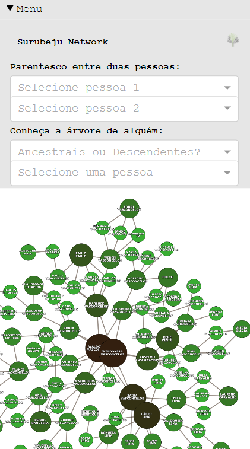

## Surubeju Network 
O objetivo deste projeto é coletar dados com todas as relações de parentesco
dentro do bairro Surubeju do município de Monte Alegre - PA e a partir desta coleta
visualizar as referidas relações em formato de Grafo.
[Acesse a aplicação aqui](http://surubeju.herokuapp.com/)

## Motivação 
No referido bairro, no qual eu resido, os habitantes tendem a constituir familias com moradores do próprio bairro. Com isso, criam-se relações de parentesco complexas e até mesmo
desconhecidas pelos residentes. Diante disso, decidi criar uma visualização dinâmica que demonstrasse todas as relações de parentesco presentes no bairro.

## Principais Ferramentas

### Networkx
"NetworkX é uma biblioteca da linguagem de programação Python
para estudar grafos e redes"
No projeto, esta biblioteca é reponsável pelo os algortimos de busca em grafos que funcionam
no backend da aplicação.

### Dash Cytoscape
"Dash Cytoscape é um componente de visualização de grafos do plotly. Renderizado pelo
Cytoscape.js, oferece integrações com layouts e callbacks do Dash."
Na aplicação, esta biblioteca cria o plot do grafo em uma página web e viabiliza todas as interações dinâmicas do usuário.

## Funcionalidades

### Relação entre dois indivíduos
Digitando o nome de duas pessoas é possível obter a relação de parentesco entre elas.

### Ancestrais e descendentes
Escolhendo um indivíduo, é possível visualizar os seus ancestrais ou descendentes.

Veja o exemplo da "Zaira Vasconcelos" com seus ancestrais e descendentes, respectivamente.

## Escolha de cores
Em referência ao termo árvore genealógica, decidi colorir as raízes da árvore de marrom e as folhas de verde.

## Responsividade

Tendo em vista que, a aplicação será acessada por usuários de diversos dispositivos, foi criada diversas disposições da interface para cada tipo de dispositivo. 

### Smartphone

### Tablet

### Desktop

